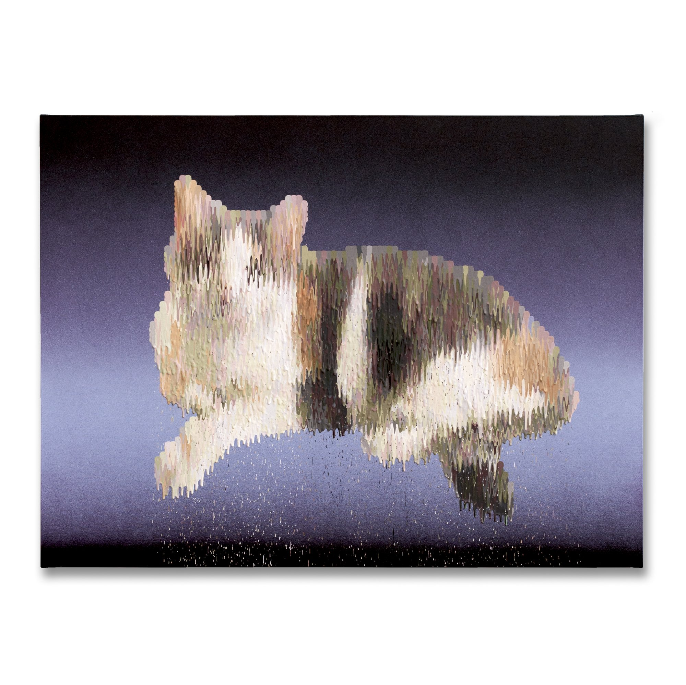
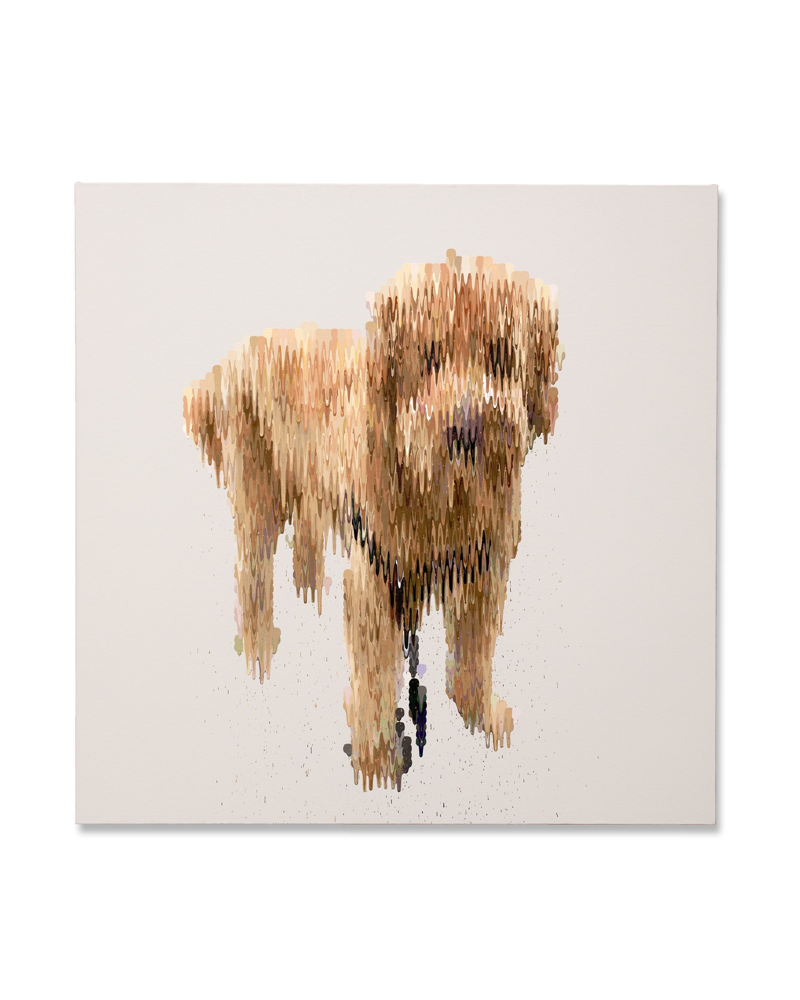
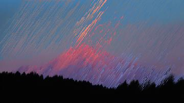

# jgao0852_9103_tut1
My first repository for IDEA9103

# Quiz 8 

---

## Part 1: Imaging Technique Inspiration

**Technique:** Pixel Sorting — Drip Dissolution Effect

**Source:** Morgan Sims, *Dripping Dolly* series

Morgan Sims' *Dripping Dolly* series applies **pixel sorting** — reordering pixels vertically by luminosity to create column-like streaks that dissolve downward into scattered droplets. The subject remains recognisable at the core while edges break into raw colour data, producing a tension between representation and entropy. I want to incorporate this dissolution quality to suggest change or memory decay. The technique is achievable at a basic level in Python by sorting pixel arrays per column, making it both an inspiring reference and a realistic starting point.

### Example Images

| | |
|---|---|
|  |  |
| *Catsandra* — cat form dissolving downward into pixel drips against a dark gradient | *Ajax* — dog form built from vertical colour columns that trail off into scattered pixels |

---

## Part 2: Coding Technique Exploration

**Technique:** p5.js Pixel Array Sorting via `loadPixels()` / `get()` / `set()`

### Example Screenshot


*Pixel sorting applied at an angled direction — columns of pixels sorted by brightness produce the characteristic drip/streak appearance.*

### Core Code Snippet

```javascript
function sortPixels() {
  // Pick a random column
  const x = floor(random(img.width));

  // Collect all pixels in this column
  let col = [];
  for (let y = 0; y < img.height; y++) {
    col.push(img.get(x, y));
  }

  // Sort by brightness — darker sinks, lighter rises
  col.sort((a, b) => brightness(a) - brightness(b));

  // Write sorted pixels back
  for (let y = 0; y < img.height; y++) {
    img.set(x, y, col[y]);
  }
}
```

### Discussion

p5.js provides direct access to an image's **pixel array** via `loadPixels()` and `get()`/`set()`. By reading each column of pixels, sorting them by a chosen channel — brightness, hue, or red value — and writing them back, the vertical drip effect from Sims' work can be reproduced algorithmically. The sort progressively reorders colour values downward, mimicking the dissolution seen in *Dripping Dolly*. This approach is approachable for beginners yet flexible enough to control direction, threshold, and sorting metric.

### Example Links

- [happycoding.io — p5.js Pixel Sorter tutorial](https://happycoding.io/tutorials/p5js/images/pixel-sorter)